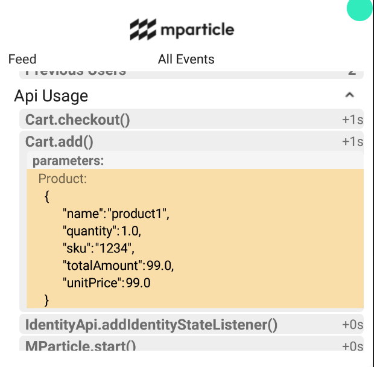
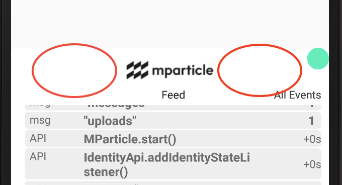
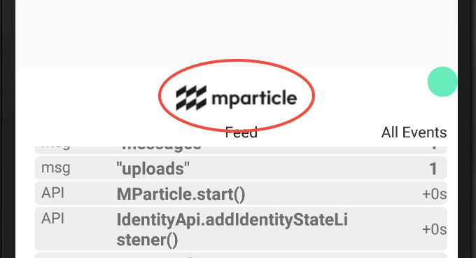

## Inspector Gadget

Inspector Gadget is a UI widget which attaches to the [mParticle Android SDK](https://github.com/mParticle/mparticle-android-sdk). It's designed to help you debug your mParticle implementation and API usage, as well as the inner workings of the mParticle Android SDK.

#### Requirements:

- MinSdkVersion 16+
- CompileSdkVersion 28

## Adding Inspector

In your app-level `build.gradle` file, add the following dependency:

```groovy
implementation 'com.mparticle:android-inspector:0.7'
```

> **Note**: You should not ship Inspector to a production app. For this reason you should only add the dependency to a debug or non-Google Play variant.

## Initializing Inspector

Inspector uses a new `SdkListener` interface exposed by the mParticle Android SDK. 

This `SdkListener` interface will only be enabled if:

- Your APK is marked as "debuggable", OR
- A specific adb property is set with your package name:

    ```sh
    adb shell setprop 'debug.mparticle.listener <PACKAGE-NAME>'
    ```

By default, Inspector will auto-start, as long as it has been added as a dependency of your app. There is **no initialization code required**.

## Viewing Inspector

When the application starts, Inspector will not be visible. **By default, Inspector will become visible when a shake gesture is detected**. Simply shake the device 3-4 times and Inspector will become visible.

You can also make Inspector visible programatically. This is very useful if you are using an emulator, and are unable to perform a shake gesture.

#### Kotlin

```kt
Inspector.getInstance()?.visible = true
```

#### Java

```java
Inspector.getInstance().setVisible(true);
```

### Exploring Inspector's Views

There are three main views in Inspector. You can navigate between the three by swiping vertically. All three will not necessarily be present at any given time.

Most events that populate these views are expandable, which is done with a simple click. When an event is expanded, you might notice that some have fields with an orange background. **This indicates that the event is "followable" in the PathFinder view**. If you click the orange area, you will be taken to the PathFinder View for that event. Events that are followable currently consist of certain API and network events.

#### Feed View

This is a real-time chronological list of SDK events. Events populate from the bottom in chronological order

#### All Events View

This list is a categorized collection of all the events that have been collected since the SDK was started. Most categories are arranged chronologically and some such as "state" are pinned.

#### PathFinder View

The PathFinder view is used to show the causal relationship between related events. This is where you will see the events that occurred because of another event, or the events that went into an event. This view exposed the inner working of the mParticle Android SDK for dissection.

For example, if your code calls `MParticle.getInstance.logEvent()` you can select the resulting "API call" event and you should see the resulting "message" that was created as a result of the API call. Then an "upload" message that was created as a result of the "message", and finally the "events" network request that was completed as a result of the upload message.

**Click** the orange area of a "followable" event to be taken to the PathFinder view



### Interacting with the Inspector

The Inspector can be pinned to either the top or bottom of the screen.

#### Resize

**Press and Drag** the teal button on the right hand, middle limit of the Inspector view to resize the window


#### Pin to top/bottom, dismiss

**Long Press and Drag** the area to the left or right of the mParticle logo.



* Drag to the top or bottom of the screen in order to pin to the top or bottom

* Drag off the screen in order to hide Inspector. To show Inspector again, use a shake gesture

#### Dismiss temporarily

**Double Tap** the area to the left or right of the mParticle logo in order to make Inspector temporarily disappear for 5 seconds


#### Export Events

**Click** the logo in order to get an Export prompt


