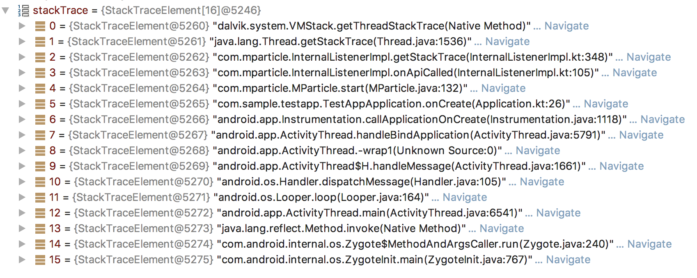
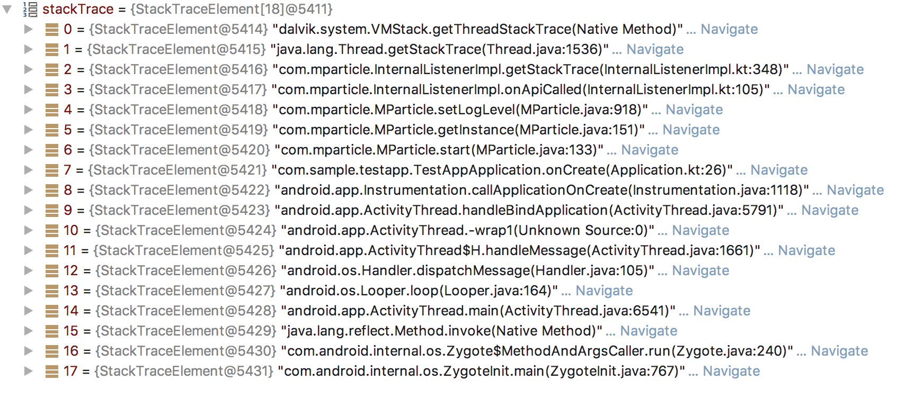

### MPartice SDK Inspector

This is a story about how we built the Android version of the MParticle SDK Inspector. We implemented a series of hooks in our SDK which the Inspector derives the information it displays from. In the course of supporting this product, we wanted to make as light a footprint as possible in the existing SDK. This means we want to minimize the level of effort and understanding it will take to update these hooks and maintain the Inspectors functionality as the SDK grows. 

Many of the elements in the UI are fairly straightforward. You could imagine a straightforward instrumentation of a hook that will alert the Inspector when a Network request starts or finishes. Same goes for when a Kit is started or stopped. We have natural bottlenecks (the good kind in this case) where a single line of code will provide all the information we need to update the UI. Luckily there are in areas of our SDK which are pretty mature at this point, so if there are changes to how we do either of those, it's going to be a pretty major update in itself.

In this blog, I'm going to focus on a few of the interesting hooks we implemented, particularly those that overcase weird edge cases or saved us on tons of future maintenance.

#### API Calls

MParticle is a singleton, with multiple classes worth of public APIs. As part of this project, one of the first things we decided we needed to display, was when and how a client invoked any of our public API methods. To do this, we needed to capture

1) which API method was invoked
2) which arguments, if any, where passed in the invokation.

Since there aren't any native features in plain old Java that would allow us to pre- or post-process API calls, like an HTTP middleware framework might have, we needed to instrument each of our public API methods with a hook into the Inspector. This isn't ideal from a maintenance perspective, it neans that we are going to have to add Inspector-specific code everytime we expand the API, we were able to minimize this cost through a few neat tricks. 

In the end, our instrumentation looked something like this

```java
public void someApiMethod(String arg1, Object arg2, List<String> arg3) {
	MParticle.getListener().onApiCalled(arg1, arg2, arg3);
	....
	.... //existing method body
	...
}
```

with this being the signature of the object returned in `getListener()`

```
class InternalListener {
	void onApiCalled(Object... objects);
}
```

In this case, the Inpector instrumentation does the work of providing the arguments, as well as indicating that an API call was made, but there is more important information we are able to gleen without having to make it any messier than it already is, such as:

1) What is the method name of this API?

2) Was this API invoked by the client, not internally by the SDK (in some cases we call our own API internally. In fact, we call some API methods from the Inspector, in cases where we pull information, such as "MParticle State", "Current/Previous Users". We don't want these showing up in the Inspector as public API invocations)

To gather this information, we make use of the StackTrace!

Analyzing a StackTrace as part of a program's execution is inherently ugly and somewhat brittle. One of the major downsides is the slowness of creating a StackTrace, couple with the fact that it has to be done on the same Thread that you are hoping to examone, so we took great care to ensure that this code is never included, let alone executed on a production build.

The upside of a StackTrace is that you can tell what happened step-by-step up until the point where it was created which, for us in the case of the Inspector, saves us a ton of work in other areas

Here are a couple tips for handling StackTraces:

1) The first few entries in a StackTrace will be related to the actual method call to pull the StackTrace.

2) Be cognizant of how refactoring and DRY principals might affect code that was previously working. StackTraces are one of the rare things where logical-equivilent changes in implementation can break a program, if the changes are upstream of the StackTrace creation

For our case, the first thing we need to do is to find the element in the StackTrace which represents the call to `onApiCalled()`



To simplify our search and make it flexible, the method we ended up on for finding the API call this was invoked by, was to find the element which indicates the entry point into the Listener class.

```kotlin
val firstClassIndex = stackTrace.indexOfFirst { it.className == javaClass.name }
// javaClass.name == com.mparticle.InternalListenerImpl
// firstClassIndex == 2
val lastClassIndex = stackTrace.sublist(firstClassIndex, stackTrace.size)
	.lastIndexOf { it.className == javaClass.name }
// lastClassIndex == 3
val apiCallIndex = lastClassIndex + 1
// apiCallIndex == 4
val apiInvocationIndex = apiCallIndex + 1
// apiInvocationIndex == 5
```

From here, we have 2 very important pieces of information. 

1) `apiCallIndex` indicates the StackTraceElement which represents the API method which was invoked; from this element we can capture the API name, "MParticle.start()". 

2) `apiInvocationIndex` indicates the StackTraceElement which represents the calling function, which in this case comes from the `com.sample.testApp` package. This means we can eliminate the possibility that this call originated from within the SDK, and pass it forward as an API event

Here is another example for a call that we wout **not** want to pass forward as an API Event



In this case, the `apiCallIndex` is 4, from which we can gather the method name "MParticle.setLogLevel()"

The `apiInvocationIndex` is 5, which points to the element `com.mparticle.MParticle.getInstance()`. This is an internal MParticle SDK method (which we gather by the package name). It looks like in this case the `setLogLevel` call was caused by the processing of the `MParticleOptions` object which was passed into `MParticle.start()`. We do not want to display this call in the inspector, because it would be confusing for a client to see an API call which they did not call themselves

##### Print classes (?) (is it worth going over here, or is it too basic..)


#### Messages

Message Events represent database entries created by the SDK. We have about 6 tables in the Android SDK, enough where it would not be outrageous to instrument each insert call alerting the Inspector that a new database entries was created. But, for our PathFinder view, which we will get more into later, we needed to be able to identifym 1 to 1, when an inserted database row was returned as part of a query.

If you don't understand *why* we need to do this, it will be come clear in [This Section](#PathFinder)

This requires us to "primary key-itize" each entry when it is inserted, and be able to glean that primary key when we query.

For example, if the "messages" table had a new entry which looked something like this: 

```

```
